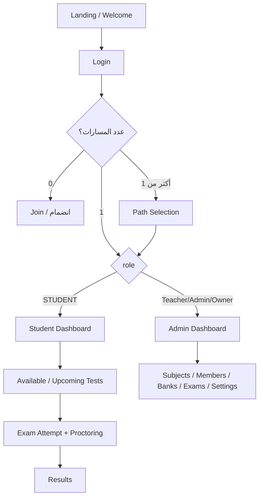

# هيكل مشروع منصة الامتحانات (Frontend)

> وثيقة مرجعية للتقسيمة المعتمدة، المجلدات، المكتبات، وتدفّق العمل  
> المشروع: `refactoring_exam_system`  
> النوع: React SPA (Vite)

---

## 1) فكرة المشروع باختصار

منصة إدارة امتحانات أكاديمية بواجهتين رئيسيتين:

| الواجهة | المستخدم | المسار الأساسي |
|--------|----------|----------------|
| **لوحة الإدارة / المعلم** | مالك مؤسسة، أدمن، معلم | `/dashboard` … |
| **بوابة الطالب** | طالب ضمن مساحة عمل | `/student/dashboard` … |

كل مستخدم يعمل داخل **مسار (Membership)** مرتبط بـ **مساحة عمل (Workspace)**:
- `INSTITUTION` = مؤسسة
- `SOLO` = معلم مستقل

التوجيه بعد تسجيل الدخول يعتمد على `role` داخل الـ membership (`STUDENT` → بوابة الطالب، غير ذلك → لوحة الإدارة).

---

## 2) المكتبات المعتمدة (Tech Stack)

### تشغيل وواجهة
| المكتبة | الدور |
|---------|--------|
| **React 19** | بناء الواجهة |
| **Vite 8** | أداة البناء والتطوير |
| **React Router DOM 7** | التوجيه بين الصفحات |
| **Tailwind CSS 4** | التنسيق (Utility classes + CSS variables للثيم) |
| **Lucide React** | الأيقونات |

### بيانات وحالة
| المكتبة | الدور |
|---------|--------|
| **Axios** | طلبات HTTP للـ Backend (`src/lib/axios.js`) |
| **Zustand** | إدارة الحالة العامة (auth, theme, language, toast…) مع `persist` في `localStorage` |

### ترجمة واتجاه
| المكتبة | الدور |
|---------|--------|
| **i18next + react-i18next** | عربي / إنجليزي + RTL/LTR |
| ملفات JSON في `src/i18n/ar` و `src/i18n/en` | نصوص الواجهة ورسائل الباك |

### مراقبة الاختبار (Proctoring)
| المكتبة | الدور |
|---------|--------|
| **@mediapipe/tasks-vision** | كشف الوجه أثناء المحاولة |

### أدوات تطوير
| المكتبة | الدور |
|---------|--------|
| ESLint + plugins | جودة الكود |
| `@vitejs/plugin-react` | دعم React في Vite |

---

## 3) التقسيمة المعتمدة للمجلدات (`src/`)

المبدأ المتفق عليه: **طبقات واضحة بدون إعادة هيكلة جذرية**  
(صفحات → مكوّنات → hooks → services → lib/store/constants)

```
src/
├── main.jsx                 # نقطة الدخول
├── App.jsx                  # تعريف كل الـ Routes
├── index.css                # ثيم shell (CSS variables) + Tailwind
│
├── assets/                  # صور ثابتة (auth, landing)
├── styles/                  # أنماط مساعدة (مثل dark mode للداشبورد)
│
├── pages/                   # صفحات كاملة (شاشة واحدة = ملف/مجلد)
├── components/              # وحدات واجهة قابلة لإعادة الاستخدام حسب المجال
├── hooks/                   # منطق الشاشات (جلب بيانات، نماذج، تدفق)
├── services/                # استدعاءات API فقط (طبقة الشبكة)
├── store/                   # Zustand stores
├── lib/                     # مساعدات نقية (normalize, axios, صلاحيات…)
├── constants/               # ثوابت (routes, auth, proctoring…)
└── i18n/                    # الترجمة (ar/en + namespaces)
```

### ماذا يوضع أين؟ (قاعدة الفريق)

| الطبقة | المسؤولية | مثال |
|--------|-----------|------|
| `pages/` | تجميع الشاشة وربط الـ hook بالمكوّنات | `SettingsPage.jsx` |
| `components/` | عرض UI فقط قدر الإمكان | `SettingsProfileSection.jsx` |
| `hooks/` | الحالة، الاستدعاءات، التحقق | `useStudentDashboard.js` |
| `services/` | `api.get/post/patch/delete` | `tests.service.js` |
| `lib/` | تحويل بيانات، صلاحيات، أدوات مشتركة | `workspaceContext.js` |
| `store/` | حالة جلسة عامة | `authStore.js` |
| `constants/` | مسارات وأسماء ثابتة | `routes.js` |
| `i18n/` | كل النصوص الظاهرة للمستخدم | `ar/settings.json` |

---

## 4) تفاصيل المجلدات حسب المجال

### 4.1 `pages/` — الشاشات

```
pages/
├── LandingPage.jsx              # الصفحة التسويقية
├── WelcomePage.jsx / JoinPage.jsx
├── LoginPage.jsx / PathSelectionPage.jsx
├── RegisterPage.jsx + register/ # تسجيل مؤسسة/معلم
├── auth/                        # نسيت كلمة المرور / إعادة التعيين
├── DashboardPage.jsx
├── subjects/                    # المواد + تفاصيل مادة
├── members/                     # أعضاء / معلمون / طلاب
├── question-banks/              # بنوك الأسئلة + المحرر
├── exams/                       # قائمة الامتحانات + معالج الإنشاء
├── settings/                    # إعدادات / كلمة مرور / إنشاء مساحة
├── invites/                     # قبول دعوة
└── student/                     # داشبورد الطالب + محاولة اختبار + نتائج
```

### 4.2 `components/` — حسب الموديول

```
components/
├── landing/          # أقسام الاندينغ
├── auth/             # أصداف تسجيل الدخول/التسجيل، OTP، اختيار مسار
├── dashboard/        # Layout / Sidebar / Guard للوحة الإدارة
├── subjects/         # جداول، مودالات، تفاصيل، مواضيع
├── members/          # طلاب ومعلمون
├── question-banks/   # بطاقات، محرر أسئلة
├── exams/            # معالج الاختبار (wizard) + إعدادات + blueprint
├── settings/         # بطاقات الملف، المؤسسة، المظهر، الخصوصية
├── student/          # dashboard/ + attempt/
├── proctoring/       # تحذير، معاينة كاميرا، Provider
├── invites/
└── common/           # Toast، SoftDeleteConfirmDialog…
```

### 4.3 `hooks/`

```
hooks/
├── useLogout.js / useEditMyProfile.js / useCreateWorkspace.js …
├── subjects/   members/   question-banks/   exams/   tests/
├── student/    useStudentDashboard.js / useExamAttempt.js
└── proctoring/ useProctoring.js / useCamera.js / useExamProctoringBootstrap.js
```

### 4.4 `services/` — طبقة الـ API

```
services/
├── auth.service.js
├── users.service.js
├── workspaces.service.js
├── subjects.service.js
├── tests.service.js              # امتحانات + attempts
├── questionBanks.service.js
├── invites.service.js / join.service.js / uploads.service.js
├── studentDashboard.service.js   # upcoming للطالب…
└── proctoring/                   # Camera, Audio, Face, Browser, WebSocket, REST
```

### 4.5 `store/` (Zustand)

| الملف | المحتوى |
|-------|---------|
| `authStore.js` | توكن، مستخدم، memberships، المسار المحدد |
| `languageStore.js` | لغة الواجهة |
| `themeStore.js` | فاتح / داكن |
| `toastStore.js` | إشعارات |
| `registrationStore.js` | تدفق التسجيل متعدد الخطوات |

### 4.6 `lib/` — المنطق المشترك

أمثلة مهمة:
- `axios.js` — Interceptors: Bearer token + `X-Workspace-Id` + refresh
- `workspaceContext.js` — صلاحيات المسار الحالي (طالب؟ مالك مؤسسة؟…)
- `postLoginNavigation.js` — أين يذهب المستخدم بعد Login
- `studentDashboardModel.js` — تطبيع ردود available/upcoming
- `apiError.js` + `i18n/translateBackendMessage.js` — رسائل أخطاء الباك مترجمة
- `proctoring/` — مساعدات المراقبة

### 4.7 `i18n/`

```
i18n/
├── index.js
├── translateBackendMessage.js
├── ar/   common, auth, navigation, settings, student, exams, …
└── en/   (نفس الـ namespaces)
```

---

## 5) تدفّق العمل العام (App Flow)



### بعد Login (منطق معتمد)
1. `POST /auth/login` → `setAuth` في `authStore`
2. `resolvePostLoginRoute(data)`:
   - مسار واحد → اختياره تلقائيًا والدخول لواجهته
   - عدة مسارات → `/path-selection`
   - بدون مسارات → `/join` (ليس الاندينغ)
3. كل طلب API محمي يأخذ:
   - `Authorization: Bearer …`
   - `X-Workspace-Id` من المسار المحدد

---

## 6) الوحدات الوظيفية وحالتها

| الوحدة | المجلدات الأساسية | ملاحظات |
|--------|-------------------|---------|
| Auth / Register / Reset | `pages/auth`, `pages/register`, `hooks/use*` | مكتمل نسبيًا |
| Path / Workspaces | `PathSelectionPage`, settings workspaces | إنشاء + حذف مسار + تحديث memberships |
| Subjects | `pages/subjects`, `hooks/subjects` | CRUD + تفاصيل + مواضيع |
| Members | `pages/members` | طلاب/معلمون + إسناد مواد |
| Question Banks | `pages/question-banks` | بنوك + محرر |
| Exams Wizard | `pages/exams`, `components/exams/wizard` | إنشاء/تعديل متعدد الخطوات |
| Settings | `pages/settings`, `components/settings` | ملف شخصي مربوط؛ تعديل مؤسسة بانتظار API workspace |
| Student Dashboard | `pages/student`, `hooks/student` | available + upcoming مربوطان؛ النتائج لاحقًا |
| Exam Attempt | `ExamAttemptPage`, `useExamAttempt` | start/save/submit + proctoring |
| i18n AR/EN | `src/i18n` | مفعّل مع تبديل لغة واتجاه |

---

## 7) قواعد اتفقنا عليها أثناء العمل

1. **الحفاظ على التقسيمة والمجلدات** — لا نعيد بناء المشروع من الصفر ولا نختلق طبقة `features/` جديدة.
2. **عدم اختراع عقود Backend** — أي زر/API جديد يحتاج endpoint واضح من Swagger.
3. **الصفحات تجمّع، الـ hooks تدير، الـ services تنادي الشبكة.**
4. **الحفاظ على التحسينات السابقة** (i18n، axios interceptors، proctoring، attempt…).
5. **Soft delete** في الواجهة عبر ديالوغ تأكيد موحّد عند الحذف.

---

## 8) كيف تقرأ الكود بسرعة؟

1. ابدأ من `App.jsx` → تعرف كل المسارات.
2. افتح الصفحة في `pages/…`.
3. انظر الـ hook الذي تستدعيه.
4. من الـ hook انزل إلى `services/` لمعرفة الـ endpoint.
5. النصوص من `i18n/ar|en`.
6. الصلاحيات من `lib/workspaceContext.js`.

---

## 9) ملخص بجملة واحدة

المشروع **React + Vite** منظم بطبقات كلاسيكية واضحة (`pages → components → hooks → services`)، مع **Zustand** للجلسة، **Axios** للـ API، **i18next** للغتين، ووحدتين كبيرتين للمستخدم: **لوحة إدارة المساحة** و**بوابة الطالب مع محاولة اختبار ومراقبة**.
